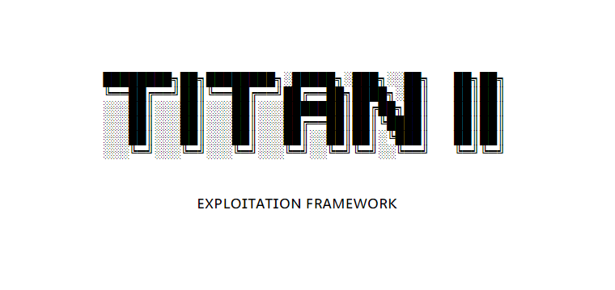

<span style="background:white">
<h1 align="center">
  <br>
  <a href="https://github.com/her3ticAVI/TITANII"></a>
  <br>
  <br>
</h1>

### Overview
```TITAN II is an exploitation tool, C2, and Red Teaming tool that I have created in order to allow myself more mobillity and less critical thinking. Automating the hard things like DC Sync's Kerberoasts etc.```

### Features
<br>
Home
<br>

```
The Home panel creates an easy to read layout of the attack platform including hosts discovered, exploited, uptime, etc.
```
<br>
Network
<br>

```
The Network Panel is a network scanner that allows for the silent or aggressive
scanning of a network taking the commands out of the mix allowing for a quick and easy scan.
```
<br>
Hosts
<br>

```
The Hosts tab allows you to import discovered hosts from the Network panel and attack them,
creating an easy to understand at a glance work space without sparing any important information.
Quick click button shortcuts to utilize post exploitation modules.
```
<br>
Exploits
<br>

```
The Exploits panel is where all the exploits are stored,
TITAN II is created in a way that allows for easy POC
importation and importation of pre-existing Metasploit Ruby Modules
```
<br>
Payloads
<br>

```
The Payloads panel allows the quick and easy creation adn deployment of
payloads on the C2 allowing for persistence, hashdumping, and a numerous
amount of other eye catching C2 features. Macro injection, AV evasion, and more.
```
<br>
Home
<br>

```
The CLI panel is a CLI interactive panel allowing for a user to interact with the
bare-metal host that is running the TITAN II C2 server.
```
<br>
Chatroom
<br>

```
The Chatroom panel is a panel that allows for multiple pentesters to use the tool
at one time and keeping communications centralized in one tool. A one stop shop for
any good Red Team engagement. Inlcuding sharing scan files, exploited machiones, etc. Uses PGP.
```
<br>
Ducky-Scripts
<br>

```
The Duck-Scripts panel is a panel that allows for the quick deployment of pre-created duckscripts
that allow a user to quickly flash a BADUSB and do drive by Payload attacks.
```
<br>
Settings
<br>

```
The Settings panel helps users change there passwords, manage tunneling to the WebApp, and for
admins to manage users, there usage, and permissions on the platform.
```

UPDATE: Progress is 50% done and rising. Screenshots will be out soon.
In progress eta August 2024
